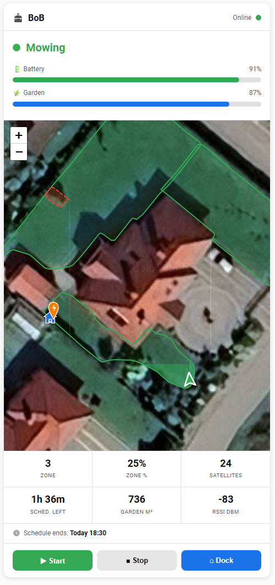

# Stiga Lawn Mower

[![GitHub Release][releases-shield]][releases]
[![GitHub Activity][commits-shield]][commits]
[![License][license-shield]](LICENSE)

[![hacs][hacsbadge]][hacs]
![Project Maintenance][maintenance-shield]

Unofficial Home Assistant integration for **Stiga A-series robot mowers** (Vista, A 1500, A 3000, …) controllable via the STIGA.GO app.

Not officially provided or supported by Stiga.

---

## Based on stiga-api

This integration is built entirely on the reverse-engineering work done by **[@matthewgream](https://github.com/matthewgream)** in the [stiga-api](https://github.com/matthewgream/stiga-api) project.

That project reverse-engineered the Stiga A-series communication protocol by deconstructing the official Android app — extracting the Firebase authentication flow, the REST API endpoints, the MQTT broker configuration, the mTLS certificates, and the Protobuf message format. Without that foundational work, this Home Assistant integration would not exist.
---

## Architecture

```
┌──────────────────┐    REST (every 6 h)   ┌──────────────────────┐
│  STIGA REST API  │ ────────────────────▶ │     Coordinator      │
│  - Auth/Refresh  │                       │  push-driven via     │
│  - /garage       │ ◀──── Discovery ───── │  async_set_updated_  │
│  - /perimeters   │                       │  data() per frame    │
└──────────────────┘                       └──────────────────────┘
                                                      ▲
┌──────────────────┐  Live status / cmds              │
│  STIGA MQTT      │ ────────────────────────────────▶│
│  (paho+mTLS)     │                                  │
│  cloud_push      │ ◀─── Commands ───────────────────│
└──────────────────┘                         HA Entity Layer
```

- **REST** handles authentication (Firebase), device discovery (`/garage`), and periodic refresh every 6 hours.
- **MQTT** delivers live status frames (activity, battery, GPS, network) and accepts commands (start, pause, dock, settings) with minimal latency.
- The coordinator is **push-driven**: MQTT frames trigger `async_set_updated_data` immediately; the 30-second REST poll acts as a liveness check only.

---

## Supported Models

All Stiga robots controllable via the **STIGA.GO app**:

- Vista models: A 6v, A 8v, A 10v, A 15v, …
- A-Series: A 500, A 1500, A 3000, …

---

## Features

### Lawn Mower Entity

| Feature | Notes |
|---|---|
| **Start mowing** | `lawn_mower.start_mowing` |
| **Pause** | Stops the robot in place (not dock) |
| **Return to dock** | `lawn_mower.dock` |
| **States** | `mowing`, `docked`, `returning`, `error` |

### Sensor Entities

| Sensor | Unit | Category | Notes |
|---|---|---|---|
| Battery | % | — | — |
| Status | — | — | — |
| Garden Completed | % | — | Garden completion while mowing |
| Zone | — | — | Current mowing zone number |
| Zone Completed | % | — | Completion within the current zone |
| Schedule Remaining | min | — | Minutes left in the active schedule window; `—` during spot cut |
| Battery Capacity | mAh | diagnostic | — |
| Cutting Height | mm | diagnostic | — |
| GPS Satellites | — | diagnostic | Number of visible satellites |
| GPS Coverage | — | diagnostic | — |
| RTK Quality | — | diagnostic | Only reported during RTK initialisation; `—` during normal mowing |
| RSSI | dBm | diagnostic | — |
| RSRP | dBm | diagnostic | — |
| RSRQ | dB | diagnostic | — |
| Signal Quality | % | diagnostic | — |
| Firmware Version | — | diagnostic | — |
| Total Work Time | h | diagnostic | Cumulative mowing hours |
| Garden Area | m² | — | — |
| Garden Zones | — | — | — |
| Obstacles | — | — | — |
| Obstacle Area | m² | — | — |

### Binary Sensor Entities

| Sensor | Notes |
|---|---|
| Cloud Connection | MQTT link to the STIGA cloud |
| Docked | Robot at charging station |
| Charging | Battery currently charging |
| Error | Active error condition (blocked, startup required) |
| Lid | Lid open/closed |
| Rain Sensor | Current rain detection state |
| Lift Sensor | Mower lifted off the ground |
| Bump Sensor | Collision detected |
| Slope Sensor | Slope too steep |

### Device Tracker Entity

| Entity | Notes |
|---|---|
| **Location** | Robot's real-time GPS position on the HA map — updated live while mowing |

### Number Entity (Configuration)

| Entity | Range | Step |
|---|---|---|
| Cutting Height | 20–60 mm | 5 mm |

### Switch Entities (Configuration)

| Switch | Notes |
|---|---|
| Rain Sensor | Enable/disable rain detection |
| Anti-Theft | PIN protection |
| Keyboard Lock | Lock physical buttons |
| Push Notifications | App push notifications |
| Obstacle Notifications | Notify on obstacle detection |
| Smart Cutting Height | Automatic height adjustment |
| Long Exit | Extended exit from charging station |

### Select Entities (Configuration)

| Select | Options | Notes |
|---|---|---|
| Rain Delay | 4 h / 8 h / 12 h | Delay before mowing resumes after rain |
| Cutting Mode | Dense Grid / Chess Board / North-South / East-West | Per mowing zone — one entity per zone |

### Button Entities (Diagnostic)

| Button | Notes |
|---|---|
| Calibrate Blades | Trigger blade calibration routine |
| Refresh Status | Request an immediate status update from the robot |

### Device Tracker — GPS Position on Map

The integration exposes a `device_tracker` entity that shows the robot's real-time position on the HA map, updated live as the robot mows.

**How it works:** The integration resolves the robot's absolute GPS position using two sources, applied in priority order:

1. **RTK offset (primary)** — when an RTK reference is available, the robot's metre-offset from the base station (received via MQTT) is combined with the reference coordinates to compute a centimetre-accurate position.
2. **GPS from status (fallback)** — the MQTT STATUS message also contains an absolute GPS fix (standard GPS, ~5–10 m accuracy). Used automatically when no RTK reference is configured or available — the device tracker works out of the box even without a base station.

The `position_source` attribute shows which source is active: `rtk_offset` or `gps_status`.

#### RTK reference — automatic detection

The integration determines the coordinate origin in this priority order:

1. **ECEF from protobuf** — the garden map blob always contains the RTK antenna's exact ECEF coordinates (X/Y/Z in metres). This is converted to WGS84 automatically — the most accurate source.
2. **API `referencePosition`** — some accounts include this field in the REST response. Used if ECEF is absent.
3. **HA-configured base station coordinates** — manual fallback, set during setup or via Reconfigure. Only needed if both automatic sources are absent.

In practice, automatic detection works for all robots that have a mapped garden. The manual coordinates act as a safety net for edge cases.

#### Setting up base station coordinates (fallback only)

If automatic detection fails (visible as a `WARNING` in the HA log), enter the GPS coordinates of your **RTK antenna** during initial setup or via **Reconfigure**:

| Field | Example |
|---|---|
| Base station latitude | `54.131528` |
| Base station longitude | `16.281694` |

**Accepted formats:**

| Format | Example |
|---|---|
| Decimal degrees (dot) | `54.131528` |
| Decimal degrees (comma) | `54,131528` |
| Degrees°Minutes'Seconds" | `54°07'53.5"N` |

#### Entity state

- **`home`** — robot is within the configured Home zone
- **`not_home`** — robot is outside the Home zone (normal state while mowing)
- **`unknown`** — RTK reference coordinates not yet available

#### Visualising the position

**Option 1 — Map card on a dashboard**

```yaml
type: map
entities:
  - device_tracker.<robot_name>_location
hours_to_show: 1
```

Replace `<robot_name>` with the robot name from the STIGA app (e.g. `device_tracker.bob_location`). The `hours_to_show: 1` option draws the mowing trail for the past hour.

**Option 2 — Map view** (HA sidebar)

Navigate to **Map** in the HA sidebar — the robot appears as a pin alongside all other tracked devices.

**Option 3 — Stiga Robot Card** (recommended)

The included Lovelace card shows the robot on a satellite map together with mowing zone polygons, obstacle polygons, and RTK antenna marker. See [Lovelace Card](#lovelace-card) below.

#### Extra attributes

| Attribute | Description |
|---|---|
| `position_source` | `rtk_offset` (reported accuracy 1–3 m) or `gps_status` (reported accuracy 10 m) |
| `offset_lat_m` | Metres north/south from the RTK reference origin (only when `rtk_offset`) |
| `offset_lon_m` | Metres east/west from the RTK reference origin (only when `rtk_offset`) |
| `heading` | Compass bearing the robot is facing (0–360°) |
| `distance_m` | Straight-line distance from the RTK reference origin (only when `rtk_offset`) |
| `base_station_lat` | Latitude of the RTK antenna (auto-detected) |
| `base_station_lon` | Longitude of the RTK antenna (auto-detected) |
| `zone_polygons` | List of mowing zone polygons `[{id, name, polygon: [[lat,lon],...]}]` |
| `obstacle_polygons` | List of obstacle polygons `[{id, name, polygon: [[lat,lon],...]}]` |

---

### Calendar Entity — Mowing Schedule

Displays the robot's weekly mowing schedule and allows creating or deleting time windows directly from Home Assistant — changes are sent to the robot via MQTT within seconds.

**Schedule granularity: 30 minutes** (hardware constraint). Times entered with non-30-minute precision are rounded down to the nearest half hour.

#### Visualising the schedule

**Option 1 — Built-in Calendar view** (sidebar)

Navigate to the **Calendar** section in the HA sidebar. The `calendar.stiga_mowing_schedule` entity appears automatically. The weekly view shows all active mowing windows.

**Option 2 — Calendar card on a dashboard**

```yaml
type: calendar
entities:
  - calendar.stiga_mowing_schedule
```

**Option 3 — Next event card**

```yaml
type: entity
entity: calendar.stiga_mowing_schedule
```

Shows the time remaining until the next scheduled mowing.

#### Adding a mowing window

1. Open the Calendar view.
2. Click on the desired day and time.
3. Fill in the event form (summary is ignored — all events are treated as mowing windows).
4. Click **Save** — the new window is sent to the robot immediately.

#### Removing a mowing window

1. Click on an existing event in the Calendar view.
2. Click the **Delete** button.
3. The updated schedule is sent to the robot immediately.

---

### Cutting Mode

Each mowing zone has its own **Cutting Mode** select entity that controls the pattern the robot uses when mowing that zone.

| Mode | Description |
|---|---|
| **Dense Grid** | Tight parallel passes — thorough, uniform cut (default) |
| **Chess Board** | Alternating perpendicular passes — decorative chess-board lawn pattern |
| **North-South** | Parallel passes aligned north–south |
| **East-West** | Parallel passes aligned east–west |

**Entity naming:**

| Scenario | Entity name |
|---|---|
| Single zone | `select.<robot>_cutting_mode` |
| Multiple zones | `select.<robot>_zone_1_cutting_mode`, `select.<robot>_zone_2_cutting_mode`, … |

**How it works:** The mode is stored in the Stiga cloud as part of the garden map (REST `/api/perimeters`). Changing the selection patches only the affected zone's bytes in the protobuf blob and sends a PATCH request to the cloud. The robot picks up the new mode on its next mowing session.

The cutting mode entities are created at integration load time based on the zones found in the garden map. If you remap your garden in the STIGA.GO app, reload the integration to refresh the zone list.

---

### Garden Layout Sensors

Four read-only sensors that reflect the garden map stored in the Stiga cloud. They are fetched once from the REST API (`/api/perimeters`) when the integration loads.

| Entity | Description |
|---|---|
| `sensor.<robot>_garden_area` | Total area of the mapped garden in m² |
| `sensor.<robot>_garden_zones` | Number of active mowing zones |
| `sensor.<robot>_obstacles` | Number of mapped obstacles |
| `sensor.<robot>_obstacle_area` | Total area covered by obstacles in m² |

These values change only when you remap your garden in the STIGA.GO app. To refresh them, reload the integration via **Settings → Devices & Services → Stiga Lawn Mower → Reload**.

> If the cloud fetch fails at startup (e.g. a transient network error), the integration retries automatically on the next poll cycle — no manual reload needed.

---

## Lovelace Card

The companion Lovelace card is available as a **separate HACS repository**:

**[TanerCRB/stiga-lawn-mower-card](https://github.com/TanerCRB/stiga-lawn-mower-card)**



Features: live satellite map with robot position, zone gradient fill showing mowing progress, mowing trail, next schedule window, stats grid (zone, zone %, satellites, schedule remaining, garden m², RSSI), and Start / Stop / Dock buttons.

### Installation via HACS

1. In HACS go to **Frontend** → **⋮** → **Custom repositories**.
2. Add URL `https://github.com/TanerCRB/stiga-lawn-mower-card` — category **Lovelace**.
3. Click **Download** on the **Stiga Lawn Mower Card** entry.
4. Press **Ctrl+F5** to reload the browser.

HACS registers the resource automatically — no manual resource entry needed.

### Quick start

```yaml
type: custom:stiga-robot-card
entity_prefix: bob    # robot name from STIGA app (lowercase)
```

For full configuration options, entity overrides, and troubleshooting see the [card repository README](https://github.com/TanerCRB/stiga-lawn-mower-card#readme).

---

## Installation

### Via HACS (Recommended)

1. Install [HACS](https://hacs.xyz/) if you haven't already.
2. In HACS, add this repository as a **Custom Repository** (category: Integration).
3. Download **Stiga Lawn Mower**.
4. Restart Home Assistant.

### Manual

1. Copy the `custom_components/stiga_lawn_mower/` folder to your Home Assistant `custom_components/` directory.
2. Restart Home Assistant.

---

## Setup

1. Go to **Settings** → **Devices & Services** → **Add Integration**.
2. Search for **Stiga Lawn Mower**.
3. Enter your STIGA.GO account **email** and **password**.
4. Click **Submit** — the integration discovers all robots on your account.

---

## Troubleshooting

### Enable Debug Logging

```yaml
logger:
  default: info
  logs:
    custom_components.stiga_lawn_mower: debug
```

### Cloud Connection Binary Sensor

The **Cloud Connection** binary sensor reflects the live MQTT connection state. If it is `Off`:
- Check your internet connection.
- Verify your credentials are correct.
- Restart the integration (Settings → Devices & Services → Stiga Lawn Mower → Reload).

### Diagnostics

Download a diagnostics report from **Settings** → **Devices & Services** → **Stiga Lawn Mower** → three-dot menu → **Download Diagnostics**.

---

## Contributing

Contributions are welcome. Open an issue or pull request on GitHub.

> **Note:** This integration is reverse-engineered and not officially supported by Stiga. It was developed with AI assistance (Claude Code). Use at your own risk.

---

## License

MIT License — see [LICENSE](LICENSE).

---

[commits-shield]: https://img.shields.io/github/commit-activity/y/TanerCRB/Stiga_Lawn_Mower.svg?style=for-the-badge
[commits]: https://github.com/TanerCRB/Stiga_Lawn_Mower/commits/main
[hacs]: https://github.com/hacs/integration
[hacsbadge]: https://img.shields.io/badge/HACS-Custom-orange.svg?style=for-the-badge
[license-shield]: https://img.shields.io/github/license/TanerCRB/Stiga_Lawn_Mower.svg?style=for-the-badge
[maintenance-shield]: https://img.shields.io/badge/maintainer-%40TanerCRB-blue.svg?style=for-the-badge
[releases-shield]: https://img.shields.io/github/release/TanerCRB/Stiga_Lawn_Mower.svg?style=for-the-badge
[releases]: https://github.com/TanerCRB/Stiga_Lawn_Mower/releases
[source]: https://github.com/TanerCRB/Stiga_Lawn_Mower/tree/main/custom_components/stiga_lawn_mower
[documentation]: https://github.com/TanerCRB/Stiga_Lawn_Mower/blob/main/README.md
[issues]: https://github.com/TanerCRB/Stiga_Lawn_Mower/issues
